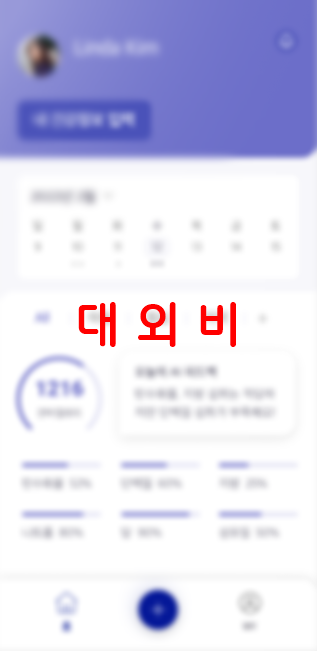
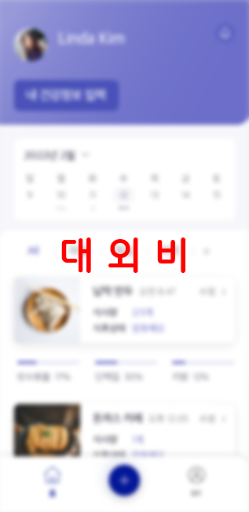
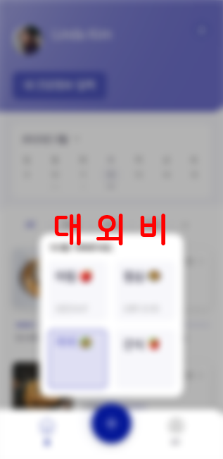
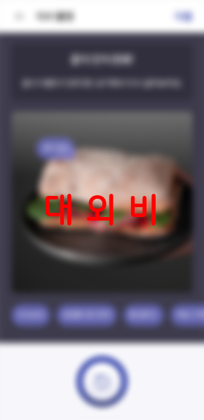
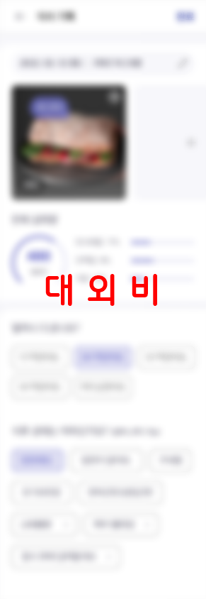

# 삼육대학교 SW프로젝트 - 식단관리앱

## 팀원: 김명진, 서민석, 백정훈, 최인규

 - 프론트 엔드: 김명진, 서민석, 백정훈, 최인규
 - 백엔드: (없음, 프토토타입)
 - 프레임워크: ReactNative(Expo), JavaScript 
 - 플렛폼: Android, iOS

## 기타 사항
- 프로토타입 어플리케이션이므로 백엔드는 진행하지 않음.
- ReactNative-cli는 개발환경 구축에 많은 어려움이 있으므로 Expo-cli로 진행
- 짧은 개발기간으로 Waterfall Processing 으로 진행

## 와이어프레임 UI

# 앱 구동 방법 (Development Mode)

- git clone 으로 프로젝트 받아오기
- 프로젝트 경로에서 Source 폴더로 이동 후, 'npm install' 명령어를 입력하여 package.js에 명시된 모듈 자동으로 모두 설치
- 'expo install react-native-svg' 모듈 추가적으로 설치
- 이후 동일 경로에서 (./Source) 'npm start' 명령어로 expo-cli 시작, 스마트폰에 expo 어플리케이션 설치(https://apps.apple.com/kr/app/expo-go/id982107779)
- 터미널에 보이는 QR코드를 스마트폰으로 인식 후, 접속
- 실행 후 무반응이거나 오류 발생 시, 터미널에서 'R'버튼을 눌러 새로고침 후 다시 시도

# 주의 사항

- API 키 등 private 요소는 key.env 파일에 저장할 것
- 개발 중인 것을 main 브랜치에 직접 push 하지 말 것!!!!

# ToDo
- [■] 각자 선택한 UI 코딩 후 22-05-01 오후 5시 오프라인 스터디 예정
- [■] 각자 선택한 UI 마무리, 22-05-05 오후 3시 오프라인 스터디 점검
- [■] 각자 선택한 UI 마무리 후 페이지 합치기, 22-05-06 오프라인 스터디, 조원끼리 피드백
- [■] 22-05-11 온라인 회의, 작업 분담 및 다음 온&오프라인 스터디를 위한 일정 조율
- [■] 22-05-12 온라인 스터디, main 브랜치 분배 후 버전 업, 작업 시작

# 캘린더 및 회의록 (Notion)

|이름|날짜|태그|비고|
|---|---|---|---|
|수행계획서 제출|2022년 4월 1일|과제업로드|
|팀 및 개별 스터디&회의|2022년 4월 11일 오후 5:00|수시회의|프로젝트 공유를 위한 github 레포지토리 생성 및 개념과 사용법 숙지|
|1차 멘토링 미팅|2022년 4월 15일 오전 10:00|멘토링|대면 미팅 / 앱 개발 방향성 수립|
|팀 및 개별 스터디&회의|2022년 4월 15일 오후 1:00|수시회의|리액트 네이티브 스터디를 위한 강의 선정 https://www.notion.so/18a888e6edf04dce95b53e58b0f02fbe|
|팀 및 개별 스터디&회의|2022년 4월 19일 오후 10:00|수시회의|스터디 진행상황 중간점검(#2 WEATHER APP까지)|
|1차 수시 회의|2022년 4월 29일|수시회의|줌 미팅 / 앱 개발 진행 사항 검토|
|팀 및 개별 스터디&회의|2022년 5월 2일 오후 3:00|수시회의|UI개발 진행상황 중간점검 https://www.notion.so/51b0c074d2ca420bb90ffcd520275be8|
|팀 및 개별 스터디&회의|2022년 5월 4일 오후 12:30|수시회의|UI개발 진행상황 중간점검 및 함께 스터디(https://www.notion.so/a12f9d9b9da446e58ae01529fb021d48)|
|팀 및 개별 스터디&회의|2022년 5월 5일 오후 12:30|수시회의|UI개발 진행상황 최종점검 및 피드백https://www.notion.so/a2daeda06fae45278a30df0c54a5691c|
|개별 긴급 회의|2022년 5월 6일 오후 8:30|수시회의|완료되지 않은 개발사항 최대한 마무리(https://www.notion.so/d867ad641c4c4121bef6daeb342ee721)|
|2차 멘토링 미팅|2022년 5월 9일|멘토링|(5월 중) 오프라인 미팅 / 카메라 기능 구현 사항 검토|
|중간보고서 제출|2022년 5월 10일|과제업로드|"중간보고서 제출(멘티, 중간보고서 검토(멘토) https://www.notion.so/a0ce5ab9cc084ab1b4e99ece7d65fbb6"|
|팀 회의|2022년 5월 10일 오후 10:15|수시회의|다음 작업 역할분담 및 스터디 일정조율을 위한 회의 https://www.notion.so/139a1cc2f9084b2aaadb81c1c7edda3c|
|팀 및 개별 스터디&회의|2022년 5월 12일 오후 7:30|수시회의|"버전 업 후 개발시작| 개발 오류&고충사항 공유https://www.notion.so/14f96263fef64b76aac6681ad8fc4a39"|
|팀 및 개별 스터디&회의|2022년 5월 17일 오후 1:30|수시회의|"대면 스터디| 개발 오류&고충사항 공유https://www.notion.so/57d166a8969749dc942deac649af5756"|
|2차 수시 회의|2022년 5월 17일|수시회의|(5월 중) 줌 미팅 진행 예정
|3차 멘토링 미팅|2022년 5월 20일|멘토링|(6월 초) 대면 미팅 / 결과보고서 작성|
|팀 및 개별 스터디&회의|2022년 5월 20일 오전 10:00|수시회의|"대면 스터디| 1차 개발 마무리 https://www.notion.so/f6e8c06b291d4d978a911dcbc265e6e2"|
|멘토링 회의|2022년 5월 30일 오전 10:00|멘토링|"개발 사항에 대한 피드백| 질의응답 https://www.notion.so/38e35c03d54b4320b02fd1248d1411be"|
|팀 및 개별 스터디&회의|2022년 6월 1일 오후 9:00|수시회의|피드백 사항에 대한 역할 분담 https://www.notion.so/6e3c5853246f4ca49ecc06bdb1c2e9eb|
|팀 및 개별 스터디&회의|2022년 6월 4일 오전 10:00|수시회의|피드백 사항에 대한 역할 분담(https://www.notion.so/db96188c0d284ab39b32f7d6ea7df079)|
|최종 멘토링 회의|2022년 6월 8일 오후 3:00|멘토링|최종 멘토링 피드백 및 기타 질문사항 답변 (https://www.notion.so/a494694163a846b484689829c63b97c3)|
|팀 스터디 & 회의|2022년 6월 14일 오후 3:00|수시회의|앱 최종 개발 마무리 및 최종보고서 작성 (https://www.notion.so/85ea16de296b4d21be6dc9e9829ae4d1)|
|최종보고서 제출|2022년 6월 17일|과제업로드|"결과보고서 제출 및 성과 등록(멘티), 결과보고서 및 결과물 검토(멘토)"|
